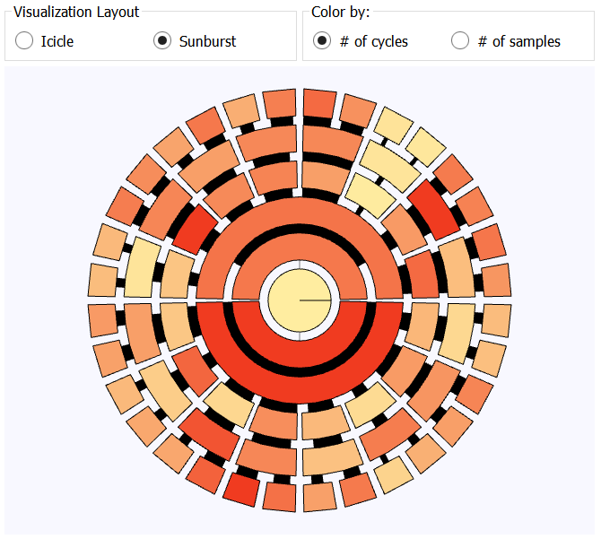
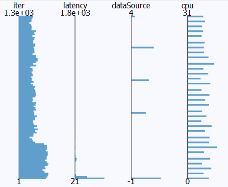

# MemAxes

MemAxes is a tool for visualizing memory access samples
acquired by [Mitos](http://github.com/scalability-llnl/Mitos).
It allows a user to view the data projected into various domains;
specifically, the layout of the hardware resources, the
code/variables, and parallel coordinates.

----

# Quick Start

## Requirements

MemAxes requires [Qt5](http://qt-project.org/qt5) and
[CMake](http://www.cmake.org) version 2.8.9 or higher, in order to
build Qt5.

## Building

1. Make sure that Qt5 is installed, and add its install
   locations to the `CMAKE_PREFIX_PATH` environment variable,
   or set `Qt5_DIR` to the directory containing Qt5Config.cmake

2. Run the following commands from the root of the MemAxes source:
   ```
   mkdir build && cd build
   cmake -DCMAKE_INSTALL_PREFIX=/path/to/install/location ..
   make
   make install
   ```

## Running
1. Select **File &rarr; Open Dataset** from the menu.
2. Select either the `XSBench` or `lulesh2` directory from the `example_data` directory.
   In an installed version of MemAxes, this is in `$prefix/share/example_data`.

----
# Views
## Hardware Topology


The hardware resources of a node are displayed as a hierarchy, where
the node is the root, its memory resources are internal nodes, and
logical cores are the leaves. MemAxes displays this hierarchy either
radially, as a Sunburst chart, or vertically, as an Icicle chart
(user-specified).

Within the nodes, MemAxes displays either the number of total memory
access cycles or samples associated with a particular resource as a
mini bar chart. The bar charts are scaled relative to all other
resources at the same depth, e.g. all L1 caches use the same scale,
but may not use the same scale used by L2 caches.

Nodes may be selected by clicking, upon which all samples associated
with the clicked resource will be selected. On mouse hover, a tooltip
shows metadata associated with the resource.

## Code/Variables


The code view shows lines of code and variables associated with the
most total memory access cycles, deemed "top offenders", in order from
highest to lowest. Underneath, a text browser shows the source for the
top offending line of code (not shown).

Either lines or variables may be selected by clicking, upon which all
samples associated with that line or variable will be selected.

## Parallel Coordinates


The parallel coordinate view is an abstract multidimensional
representation that shows all values of all samples in one view. Each
parallel axis denotes an attribute of the sample, and each polyline
that intersects the axes represents a single sample.

MemAxes includes options to change the opacity of selected or
unselected samples, as well as show histograms representing the number
of samples that intersect an axis over small bins.

The user may select ranges on any axis by clicking and dragging
vertically on an axis, as well as rearrange axes by dragging the name
of the axis left or right.

# Console

MemAxes includes a console to show and execute data operations. These
include loading data, selecting samples in different ways, and
changing the visibility of samples. This is currently a WIP, you may
try some of the example commands but keep in mind many of them won't
work just yet ;)

# Authors

MemAxes was written by Alfredo Gimenez.

# License

MemAxes is released under an LGPL license. For more details see the LICENSE file.

`LLNL-CODE-663358`
