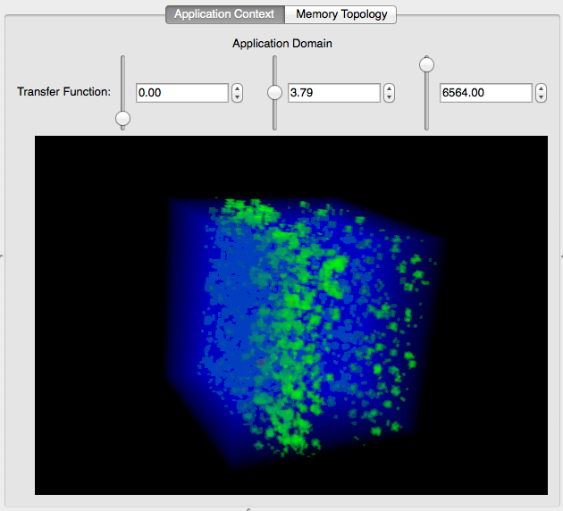

# MemAxes

MemAxes is a tool for visualizing memory access samples
acquired by load/store sampling mechanisms like Intel PEBS or AMD
IBS. It allows a user to view the data projected into various domains;
specifically, the layout of the hardware resources, the
code/variables, the dataset domain, and parallel coordinates.

----

# Quick Start

## Requirements

MemAxes requires [Qt5](http://qt-project.org/qt5) and
[VTK](http://www.vtk.org).  It also requires
[CMake](http://www.cmake.org) version 2.8.9 or higher, in order to
build Qt5.

## Building

1. Make sure that Qt5 and VTK are installed, and add their install
   locations to the `CMAKE_PREFIX_PATH` environment variable.

2. Run the following commands from the root of the MemAxes source:
   ```
   mkdir build && cd build
   cmake -DCMAKE_INSTALL_PREFIX=/path/to/install/location ..
   make
   make install
   ```

## Running
1. Select **File &rarr; Load Data** from the menu.
2. Select the lulesh directory from the `example_data` directory.
   In an installed version of MemAxes, this is in `$prefix/share/example_data`.

----
# Views
## Hardware Topology


The hardware resources of a node are displayed as a hierarchy.
Internal nodes in the hierarchy represent memory resources, i.e.
NUMA nodes and caches, and leaves represent logical processors.
MemAxes can show this hierarchy either radially (as shown) or vertically,
by choosing either Sunburst or Icicle, respectively.

The colors of the segments within the hierarchy represent either total
memory access cycles associated with the resource or total memory access
samples associated with it (you can select an option in the top pane).

The thick black lines between segments represent the total number of
transactions between pairs of resources, assuming the hardware copies
memory between caches from largest to smallest after the memory is found.

Nodes may be selected by clicking, upon which all samples associated
with the clicked resource will be selected. On mouse hover, a tooltip
shows metadata associated with the resource.

## Code/Variables


The code view shows lines of code and variables associated with the
most total memory access cycles, deemed "top offenders", in order from
highest to lowest. Underneath, a text browser shows the source for the
top offending line of code (not shown).

Either lines or variables may be selected by clicking, upon which all
samples associated with that line or variable will be selected.

## Application Context


If samples are mapped to x, y, and z locations, the application
context view shows a direct volume rendering of the number of samples
associated with each location on a uniform grid. The transfer function
automatically configures based on the selection, such that the average
values are shown in green with half opacity, the maximum values are
shown in red with full opacity, and the lowest values are shown in
blue with nearly zero opacity. The user may manually configure the
transfer function as well (though primitively, for now).

There is no selection capability in this view, but the rendering will
represent the current selection only (or the entire dataset, if
nothing is selected).

## Parallel Histograms


This view shows a histogram of each axis for the current selection (or
for all the data, if nothing is selected).

The user may select ranges on any axis by clicking and dragging
vertically on an axis, as well as rearrange axes by dragging the name
of the axis left or right.

# Console

MemAxes includes a console to show and execute data operations. These
include loading data, selecting samples in different ways, and
changing the visibility of samples. This is currently a WIP, you may
try some of the example commands but keep in mind many of them won't
work just yet ;)

# Authors

MemAxes was written by Alfredo Gimenez.

# License

MemAxes is distributed under the Apache-2.0 license with the LLVM exception.
All new contributions must be made under this license. Copyrights and patents
in the Mitos project are retained by contributors. No copyright assignment is
required to contribute to MemAxes.

See [LICENSE](https://github.com/llnl/memaxes/blob/main/LICENSE) and
[NOTICE](https://github.com/llnl/memaxes/blob/main/NOTICE) for details.

SPDX-License-Identifier: (Apache-2.0 WITH LLVM-exception)

`LLNL-CODE-838739`
